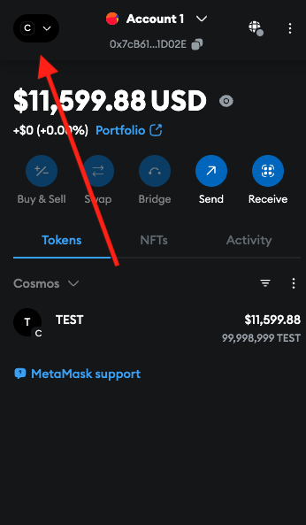
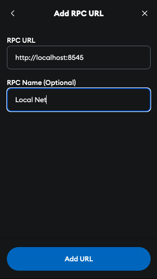
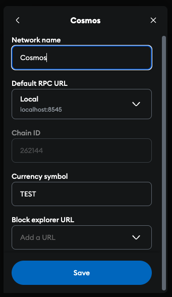

# Example Cosmos EVM Chain

This directory contains an example chain that uses the Cosmos EVM
modules. It is based on the simapp implementation on the Cosmos SDK
repository, which itself is a simplified version of a Cosmos SDK-based
blockchain.

This chain implementation is used to demonstrate the integration of Cosmos EVM
as well as to provide a chain object for testing purposes within the repository.

## Config

By default, this chain has the following configuration:

| Option              | Value                  |
|---------------------|------------------------|
| Binary              | `evmd`                 |
| Chain ID            | `cosmos_262144-1`      |
| Custom Opcodes      | -                      |
| Default Token Pairs | 1 for the native token |
| Denomination        | `atest`                |
| EVM permissioning   | permissionless         |
| Enabled Precompiles | all                    |

## Running The Chain

To run the example, execute the local node script found within this repository:

```bash
./local_node.sh [FLAGS]
```

Available flags are:

- `-y`: Overwrite previous database
- `-n`: Do **not** overwrite previous database
- `--no-install`: Skip installation of the binary
- `--remote-debugging`: Build a binary suitable for remote debugging

## Connect to Wallet

For the sake of this example, we'll be using Metamask:

1. Use the following seed phrase when adding a new wallet:
`gesture inject test cycle original hollow east ridge hen combine
junk child baconzero hope comfort vacuum milk pitch cage oppose
unhappy lunar seat`
2. On the top left of the Metamask extension, click the Network button.
3. Click Add custom network from the bottom of the modal.
4. Under Default RPC URL, add the RPC URL as http://localhost:8545. Ensure your chain is running.
5. Once added, copy the rest of the settings shown in the below images.






## Available Cosmos SDK Modules

As mentioned above, this exemplary chain implementation is a reduced version of `simapp`.
Specifically, instead of offering access to all Cosmos SDK modules, it just includes the following:

- `auth`
- `authz`
- `bank`
- `capability`
- `consensus`
- `distribution`
- `evidence`
- `feegrant`
- `genutil`
- `gov`
- `mint`
- `params`
- `slashing`
- `staking`
- `upgrade`
